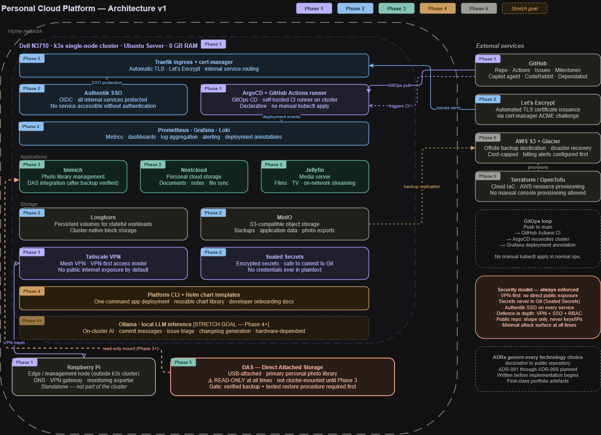

# Platform Architecture

> **Version:** 1.0  
> **Status:** Living document — updated as architectural decisions are made  
> **Diagram source:** [`docs/diagrams/architecture-v1.drawio`](./diagrams/architecture-v1.drawio)

---

## Table of Contents

1. [Vision](#1-vision)
2. [System Overview](#2-system-overview)
3. [Non-Goals](#3-non-goals)
4. [Hardware Inventory and Constraints](#4-hardware-inventory-and-constraints)
5. [Security Model](#5-security-model)
6. [Core Technology Stack](#6-core-technology-stack)
7. [High-Level Architecture](#7-high-level-architecture)
8. [Phase Sequencing Rationale](#8-phase-sequencing-rationale)
9. [Architecture Decision Records](#9-architecture-decision-records)

---

## 1. Vision

This platform is a self-hosted, cloud-native internal developer platform running on commodity hardware. It provides personal cloud services — photo management, file sync, media streaming, and automated backup — alongside a fully instrumented GitOps-driven CI/CD pipeline and observability stack.

The platform is designed to be operated as a real system: declarative configuration, automated deployment, monitored continuously, and recoverable from documented runbooks. Every significant technology choice is recorded as an Architecture Decision Record before implementation begins.

---

## 2. System Overview

The platform is a single-node Kubernetes cluster running on a Dell laptop, with a Raspberry Pi operating independently as a network edge node. All application and infrastructure configuration is managed declaratively through Git. No manual cluster operations are performed in normal circumstances — all changes flow through pull requests, CI validation, and GitOps reconciliation.

### Primary capabilities

- **Photo management** — personal photo library, searchable and accessible remotely via VPN
- **Personal cloud storage** — documents, notes, and files synced across devices
- **Media server** — film and TV library streamable on-network and over VPN
- **Automated backup** — data versioned, replicated, and recoverable via documented procedure
- **CI/CD pipeline** — code changes tested and deployed automatically on self-hosted infrastructure
- **Observability** — cluster and application health visible through unified dashboards and alerting

### Design principles

- **GitOps-first** — cluster state is always derived from Git; drift is structurally prevented
- **VPN-first** — no service is exposed to the public internet without an explicit, documented decision
- **Security by default** — secrets management, SSO, and network policies are first-class concerns from day one
- **Lightweight by necessity** — constrained hardware requires deliberate selection of low-overhead tooling throughout
- **Documented decisions** — architectural choices are recorded with context, alternatives considered, and tradeoffs accepted

---

## 3. Non-Goals

The following are explicitly out of scope. Documenting non-goals prevents scope creep and clarifies the intended boundaries of the system.

| Non-goal | Notes |
|---|---|
| Production SLAs or uptime commitments | This is not a production system. Downtime is acceptable. |
| Multi-tenancy | Single operator, single user. No isolation requirements between tenants. |
| Formal compliance frameworks | SOC2, ISO 27001, and similar frameworks are out of scope. |
| Cost-optimised commercial architecture | Spend is minimised but not systematically engineered. |
| FPGA integration | Deferred. Documented as a future possibility only. |
| Self-hosted Git or CI tooling | GitHub and GitHub Actions are the chosen pattern. Gitea, Forgejo, and Drone are out of scope. |
| High availability or multi-node resilience | Single-node cluster. HA is a stretch goal for a later phase, not a current requirement. |
| DAS modification or reformatting | The DAS is treated as read-only source data at all times. See [Section 4](#4-hardware-inventory-and-constraints). |

---

## 4. Hardware Inventory and Constraints

### Inventory

| Component | Specification | Role |
|---|---|---|
| Dell Laptop | Intel Pentium N3710 · 4 cores · 8 GB RAM · Ubuntu Server | Primary k3s node and workload host |
| Raspberry Pi | ARM · low power | Edge and management node. DNS, VPN gateway, monitoring exporter. Not part of the Kubernetes cluster. |
| DAS (Direct Attached Storage) | USB-attached · personal photo library | Read-only source data. Not mounted by any cluster workload until a validated backup and restore procedure exists. |
| FPGA Board | — | Deferred. No current role. |

### DAS safety policy

> ⚠️ The DAS contains the sole primary copy of the personal photo library. It must not be mounted, written to, or modified by any cluster workload until both of the following conditions are met:
> 1. An independent backup of all DAS contents has been verified
> 2. A restore procedure has been tested end-to-end and documented in [`docs/runbooks/RB-003`](./runbooks/RB-003.md)
>
> S3 Glacier is available as a disaster recovery target but is not a substitute for a tested local restore procedure.

### Architectural constraints

The hardware profile imposes real constraints that shape technology choices throughout the stack.

**8 GB RAM on a single node** is tight when Kubernetes system pods, observability tooling, and applications run simultaneously. Lightweight alternatives are required at every layer:

- k3s instead of kubeadm
- Grafana Alloy instead of the full OpenTelemetry Collector
- Loki in single-binary mode
- Authentik instead of Keycloak

**Limited single-thread CPU performance** means CPU-intensive workloads — local LLM inference, heavy data processing, hardware-accelerated transcoding — are deferred until the hardware profile is upgraded or a dedicated node is added.

These constraints are reflected in every ADR that involves a technology selection decision.

---

## 5. Security Model

Security is a first-class concern. The platform handles personal data including photos, documents, and credentials, and is accessible from the public internet via VPN. The security model is explicit and layered.

### Core principles

| Principle | Implementation |
|---|---|
| VPN-first | No service is exposed to the public internet directly. All remote access is through Tailscale. Public exposure of any service requires a deliberate, documented architectural decision. |
| Secrets never in Git | No credentials, tokens, API keys, IP addresses, or domain names are committed to the repository in plaintext. All secrets are managed via Sealed Secrets and injected at runtime. |
| Minimal attack surface | Only required services run. No default-enabled services. No open ports without a documented justification. |
| Defence in depth | Tailscale VPN + Authentik SSO + Kubernetes RBAC + network policies. Each layer is independently meaningful. |
| Authentication everywhere | All internal services are protected by Authentik SSO. No service is accessible without authentication, even inside the cluster network. |

### What is safe to publish publicly

The public repository is a portfolio and reference asset. The rule is simple: publish the shape of the system, never the keys to it.

| Safe to publish | Must never be published |
|---|---|
| Architecture diagrams | IP addresses or hostnames |
| ADRs and design decisions | Domain names or DNS records |
| Kubernetes manifests (with placeholders) | Tailscale auth keys or node keys |
| Helm charts and values templates | TLS private keys or certificates |
| Terraform module definitions | API tokens or credentials of any kind |
| CI/CD pipeline definitions | Authentik secrets or session keys |
| Runbooks and operational docs | Any file containing real environment values |
| Grafana dashboard JSON | Longhorn or MinIO access credentials |

### Secret management pattern

All secrets follow a single consistent pattern. A public placeholder exists in Git. The real value exists only in a Sealed Secret — encrypted with the cluster's public key, safe to commit — or in an external secrets store. No exceptions to this pattern are permitted.

---

## 6. Core Technology Stack

The following technologies form the committed core of the platform. Depth in these technologies is prioritised over breadth. Stretch goals and deferred technologies are noted separately.

| Layer | Technology | Rationale |
|---|---|---|
| Operating system | Ubuntu Server | Existing familiarity, broad documentation, well-supported for k3s |
| Kubernetes distribution | k3s | Lightweight single-binary distribution. Lower operational overhead than kubeadm on constrained hardware. See ADR-001. |
| GitOps | ArgoCD | Industry-standard. Strong community. Declarative reconciliation. Excellent UI for verifying deployment state. See ADR-002. |
| CI/CD | GitHub Actions + self-hosted runner | Mirrors patterns used in production platform engineering environments. Self-hosted runner runs on the k3s cluster. See ADR-008. |
| Ingress | Traefik + cert-manager | Bundled with k3s. cert-manager handles Let's Encrypt certificate lifecycle automatically. |
| Remote access | Tailscale | Mesh VPN. Zero-config peer-to-peer networking. VPN-first access model enforced from day one. |
| Observability | Prometheus + Grafana + Loki | Standard cloud-native observability stack. Metrics, dashboards, log aggregation, and alerting in a single coherent system. See ADR-004. |
| Storage | Longhorn + MinIO | Longhorn provides persistent volumes for stateful workloads. MinIO provides S3-compatible object storage for backups and application data. See ADR-003. |
| Identity | Authentik | OIDC/SSO. Lower operational footprint than Keycloak. Strong community. Protects all internal services. |
| Infrastructure as code | Helm + Terraform/OpenTofu | Helm for Kubernetes application packaging. Terraform for cloud resource provisioning in Phase 5. |

### Stretch goals (Phase 4+)

The following are explicitly not committed. Each requires the core platform to be stable and documented before evaluation.

- **Service mesh** — Linkerd (preferred over Istio for resource profile)
- **Internal developer portal** — Port or lightweight Backstage
- **Local AI inference** — Ollama + Open WebUI (hardware-dependent)
- **Hybrid cloud** — AWS S3 integration, GCP free tier experimentation

---

## 7. High-Level Architecture



> Diagram source: [`docs/diagrams/architecture-v1.drawio`](./diagrams/architecture-v1.drawio). Update and re-export when the architecture changes. Version the exported PNG alongside the source file.

### Layer summary

| Layer | Description |
|---|---|
| Compute | Single-node k3s cluster on the Dell laptop. The Raspberry Pi operates independently as a network edge node outside the cluster boundary. |
| Ingress and TLS | Traefik routes all internal traffic. cert-manager issues and renews Let's Encrypt certificates automatically. All services use HTTPS. |
| Identity | Authentik provides SSO via OIDC. All internal services authenticate through it. No per-service credential management. |
| GitOps | All application and infrastructure configuration lives in Git. ArgoCD reconciles cluster state continuously. No manual `kubectl apply` in normal operations. |
| CI pipeline | GitHub Actions triggers on pull requests. The self-hosted runner on k3s executes builds, linting, and validation. ArgoCD handles deployment on merge. |
| Observability | Prometheus scrapes cluster and application metrics. Loki aggregates logs. Grafana provides unified dashboards, alerting, and deployment annotations. |
| Storage | Longhorn provides persistent volumes for stateful workloads. MinIO provides S3-compatible object storage for backups and application data. |
| Remote access | Tailscale mesh VPN. No services are exposed to the public internet until explicitly evaluated and approved per service. |
| Secret management | Sealed Secrets encrypts credentials for safe Git storage. Real values are never committed in plaintext. |

### GitOps flow

```
Developer pushes to feature branch
        │
        ▼
GitHub Actions CI (GitHub-hosted runner)
  • YAML and manifest linting
  • Kubernetes manifest validation
  • Helm chart linting
  • Secret scanning (Gitleaks)
  • Copilot PR review + CodeRabbit review
        │
        ▼
Pull request reviewed and merged to main
        │
        ▼
GitHub Actions (self-hosted runner on k3s)
  • ArgoCD sync triggered
  • Post-deploy smoke tests
  • Grafana deployment annotation created
        │
        ▼
Cluster state reconciled — no manual intervention
```

---

## 8. Phase Sequencing Rationale

The platform is built in five phases. The sequencing is not arbitrary — each phase establishes the foundation that the next depends on.

| Phase | Focus | Sequencing rationale |
|---|---|---|
| **1 — Foundations** | k3s cluster, Tailscale VPN, ArgoCD, first GitOps workload | Nothing else can be built without a running cluster and a working GitOps pipeline. The runner depends on the cluster; ArgoCD depends on the repo structure. |
| **2 — Core platform services** | Ingress, TLS, storage, observability, SSO, CI runner | These are the platform primitives. Applications cannot be deployed reliably without persistent storage and ingress. Observability must be in place before applications are operated. Secrets management must exist before any sensitive workload is deployed. |
| **3 — Applications** | Immich, Nextcloud, Jellyfin, backup pipeline, DAS integration | Applications depend on Phase 2 primitives. DAS integration is explicitly gated on a validated backup and restore procedure — this gate must not be bypassed. |
| **4 — Platform engineering features** | Platform CLI, Helm templates, alerting, developer onboarding | Internal platform tooling is built on top of a stable, instrumented application layer. The CLI wraps operations that already work. |
| **5 — Hybrid cloud** | AWS S3 offsite backup, Terraform cloud IaC, cross-cloud experimentation | Cloud integration is additive. It extends the existing platform rather than replacing any part of it. Cost controls are configured before any cloud resources are provisioned. |

### Hard sequencing dependencies

The following dependencies are strict. Phases cannot be reordered around them.

- Phase 2 secrets management must be complete before any workload with sensitive credentials is deployed
- DAS must not be mounted by any cluster workload until RB-003 (backup and restore runbook) is written and tested
- Phase 5 cloud resources must not be provisioned until AWS billing alerts are configured

---

## 9. Architecture Decision Records

All significant technology choices are documented as Architecture Decision Records before implementation begins. ADRs are committed to [`docs/adrs/`](./adrs/) and are not modified after acceptance — superseded ADRs are linked to their replacement.

### ADR format

Each ADR contains the following sections:

- **Status** — Proposed / Accepted / Superseded
- **Context** — the problem or decision, and the constraints that apply
- **Options considered** — alternatives evaluated with a brief summary of each
- **Decision** — what was chosen and why
- **Consequences** — tradeoffs accepted; what this makes easier and harder

### ADR index

| ADR | Topic | Status |
|---|---|---|
| [ADR-001](./adrs/ADR-001.md) | Cluster distribution choice — k3s vs Talos Linux vs kubeadm | Accepted |
| [ADR-002](./adrs/ADR-002.md) | GitOps tooling — ArgoCD vs FluxCD | Accepted |
| [ADR-003](./adrs/ADR-003.md) | Persistent storage — Longhorn vs Ceph vs NFS | Accepted |
| [ADR-004](./adrs/ADR-004.md) | Observability stack — Prometheus/Grafana/Loki vs alternatives | Accepted |
| [ADR-005](./adrs/ADR-005.md) | Application selection — Immich, Nextcloud, Jellyfin | Proposed |
| [ADR-006](./adrs/ADR-006.md) | Platform CLI design — language, interface, scope | Proposed |
| [ADR-007](./adrs/ADR-007.md) | Hybrid cloud architecture — AWS vs GCP vs self-hosted only | Proposed |
| [ADR-008](./adrs/ADR-008.md) | CI/CD architecture — self-hosted vs hosted runners, bootstrap dependency | Accepted |
| [ADR-009](./adrs/ADR-009.md) | AI tooling strategy — Copilot, CodeRabbit, local LLM stretch goal | Proposed |

> ADR-001, ADR-002, and ADR-008 are marked Accepted as their decisions are reflected in the current architecture. Remaining ADRs move to Accepted status as each phase begins.
