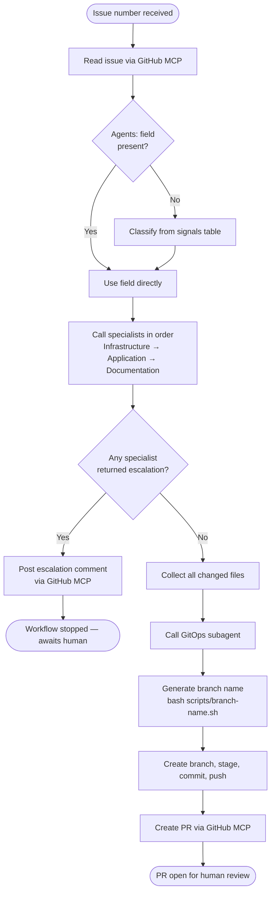

# AI Engineering Approach

> **Version:** 1.2
> **Status:** Living document — updated when AI workflow, tool policy, or agent context-loading conventions change
> **Related:** [`docs/decisions/project-approach.md`](./project-approach.md) · [`.github/agents/`](../../.github/agents/)

---

## Purpose

This document defines the principles and conventions governing AI tool usage
throughout this project. It is the reference point for any future AI tooling
decision and the context any agent needs to understand how AI is used here.

---

## Principles

**Traceable.** Every AI action that touches the codebase is visible in Git
history, PR comments, or CI logs. Nothing happens silently.

**Reversible.** No AI action bypasses the human review gate. Every change
can be reverted via a standard Git revert.

**Human-gated.** AI handles first-draft and mechanical work. A human
approves every change before it reaches the main branch. This gate is
non-negotiable regardless of AI confidence.

**Automation-first.** AI is not used for deterministic, repeatable tasks
that have no judgment component. If a bash script can do it reliably,
write the script. AI tokens are reserved for work that requires reasoning,
generation, or contextual judgment.

**IDE-agnostic.** Agent instruction files are plain markdown documents in
the repository. Switching between Copilot, Cursor, or Claude Code requires
no changes to the agent files — only the mechanism for loading them differs
by tool (see [Context architecture](#context-architecture)).

**Quality-in quality-out.** Agent output quality is directly proportional to
issue quality. Vague issues produce vague implementations. The issue template
and upload script exist to enforce this contract.

---

## Tool roles

| Tool | Role | When active |
|---|---|---|
| AI chat (Copilot Chat, Claude, etc.) | Planning, issue generation, architectural discussion | Any time |
| Coding agent (Copilot agent, Claude Code, etc.) | Issue implementation — writes code, creates files, opens PRs | When assigned a well-formed issue |
| AI PR review (Copilot review, CodeRabbit) | First-pass review before human reads the diff | On every PR automatically |
| GitHub Actions | CI validation — linting, secret scanning, manifest validation | On every PR and merge |
| Local LLM (Ollama) | On-cluster inference — commit messages, summaries | Stretch goal, Phase 4+ |

No tool in this list has merge authority. No tool bypasses secret scanning.

---

## Context architecture

Agent instruction files are plain markdown. Any AI tool can be pointed at
them explicitly. The only tool-specific behaviour is auto-loading.

```
.github/instructions/generic.instructions.md
        │
        │  Auto-loaded by VS Code Copilot. Universal security rules
        │  and routing table. All issues start at platform.agent.md.
        │  For other tools, load manually.
        │
        └── .github/agents/                    ← loaded on demand
                platform.agent.md              ← single entry point — all issues start here
                git-ops.agent.md               ← subagent only — all git operations
                documentation.agent.md         ← subagent only
                infrastructure-agent.md        ← subagent only
                application-agent.md           ← subagent only

.agents/skills/                                ← VS Code Copilot skill file convention
        documentation/
                SKILL.md                       ← judgment and convention detail

docs/contributing/
        templates/                             ← document structure, referenced by agents

scripts/
        branch-name.sh                         ← deterministic branch name from issue number + title
```

Always-loaded context contains only: security absolutes, repo navigation,
and the routing table to agent files. Everything else is on demand.

**Using agent files outside Copilot:** point the tool at the platform agent
explicitly at the start of the session — e.g. in Claude Code:
`read .github/agents/platform.agent.md` before beginning the task.

---

## Agent orchestration

All work in this repository flows through a single Platform orchestrator agent. The orchestrator reads the issue, delegates to specialist subagents, and calls the GitOps subagent once at the end to produce a single PR. No specialist agent commits or pushes directly.



Deterministic steps — branch naming, PR creation — are handled by scripts and GitHub MCP rather than AI reasoning. AI tokens in the GitOps and Platform agents are reserved for commit message subject lines and PR body generation.

---

## Issue quality contract

Issues are the primary interface between human intent and agent output.
Every agent-targeted issue must contain:

- Specific, scoped title in imperative mood
- Context explaining why the work is needed and which phase it belongs to
- Numbered, testable acceptance criteria
- Explicit list of files the agent should touch
- Explicit list of files the agent must not touch
- Constraints — things the agent must not do
- Which agents to invoke — listed in the `**Agents:**` field as a comma-separated list (e.g. `Infrastructure, Documentation`)

Issues that omit these fields produce unpredictable output. The
`scripts/upload-issues.sh` script and the issue template exist to make
compliance the path of least resistance.

---

## What AI does not decide unilaterally

- **Architectural decisions** — AI assists in researching and drafting ADRs
  but every ADR requires human sign-off before it moves to Accepted status
- **Merging pull requests** — every merge requires human approval
- **Safety-gated operations** — the DAS and any resource with an explicit
  gate condition in `docs/architecture.md` require human confirmation
- **New tooling adoption** — tools not listed in this document or an ADR
  are not used without a documented decision

When an agent encounters a decision outside its scope it stops, comments
on the issue, and waits. It does not proceed and correct later.